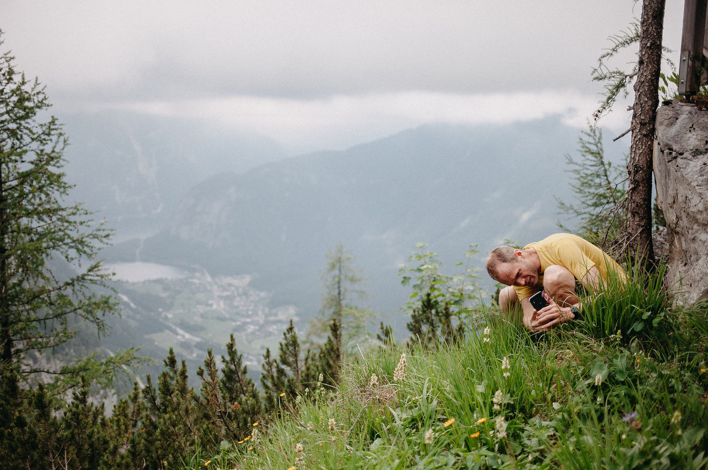

I am a macroecologist doing research on issues of spatial scale, statistics, biodiversity, and its current temporal change. I work at [Faculty of Environmental Sciences](https://www.fzp.czu.cz/en/) of Czech University of Life Sciences where I teach macroecology, biogeography, and Bayesian statistics. I am also an associate editor of [Global Ecology and Biogeography](https://onlinelibrary.wiley.com/journal/14668238#pane-01cbe741-499a-4611-874e-1061f1f4679e01) (Wiley) and [Nature Conservation](https://natureconservation.pensoft.net/) (Pensoft).

**My** [CV](https://github.com/petrkeil/CV/blob/master/Petr_Keil_CV.pdf)

**Office phone:** +420 22438 2659

**E-mail:** <keil@fzp.czu.cz>

**Twitter:** [R_you_cereal](https://twitter.com/R_you_cereal)

**GitHub:** [petrkeil](https://github.com/petrkeil)

**Google Scholar:** [SUAqa68AAAAJ&hl](https://scholar.google.com/citations?user=SUAqa68AAAAJ&hl=en)

**Address:** Department of Spatial Science, Faculty of Environmental Sciences,
Czech University of Life Sciences Prague, Kamycka 129, 165 21, Praha - Suchdol,
Czech Republic

